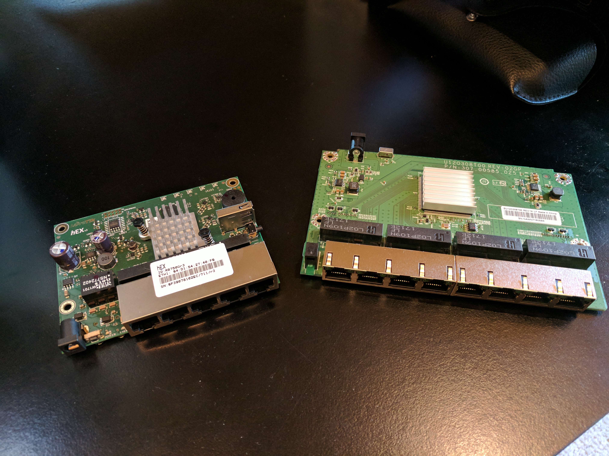
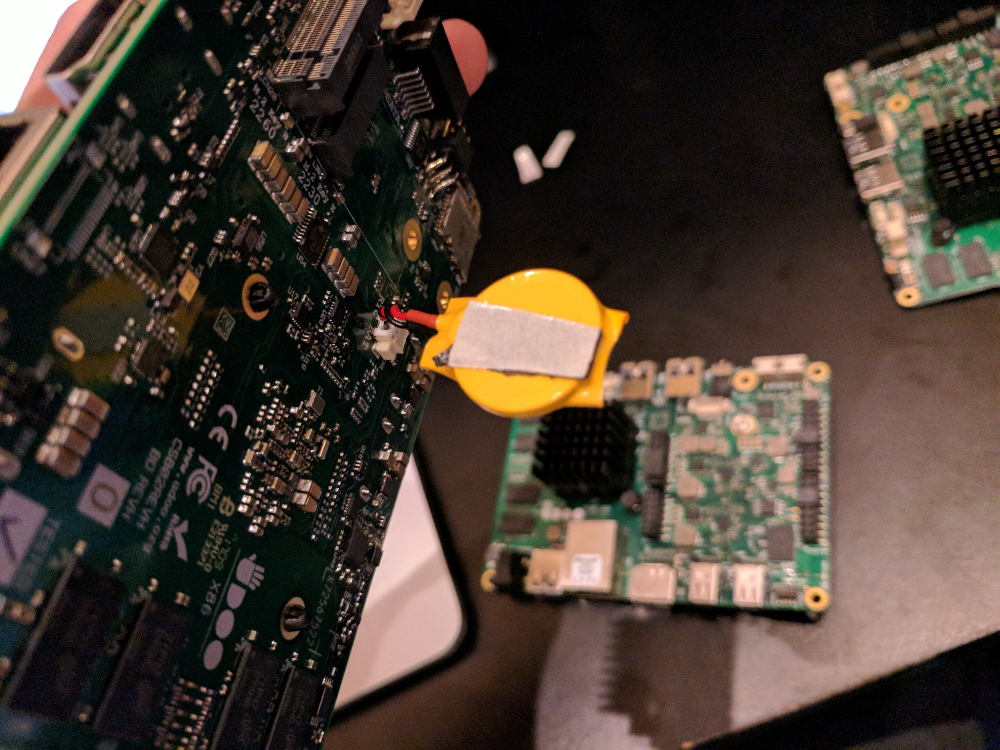
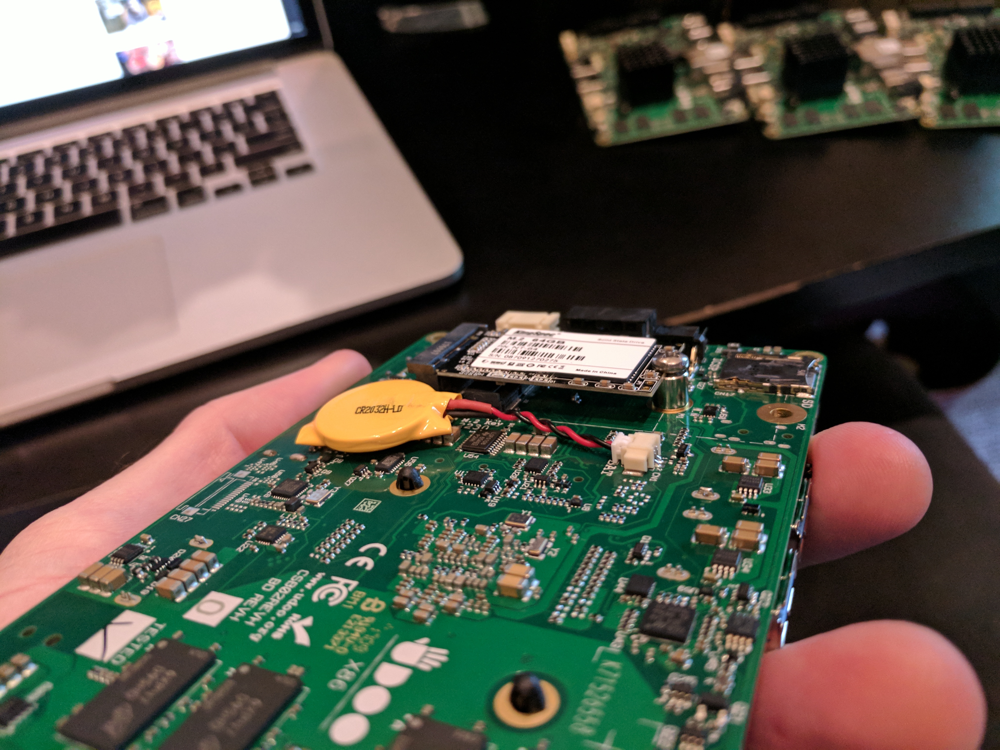
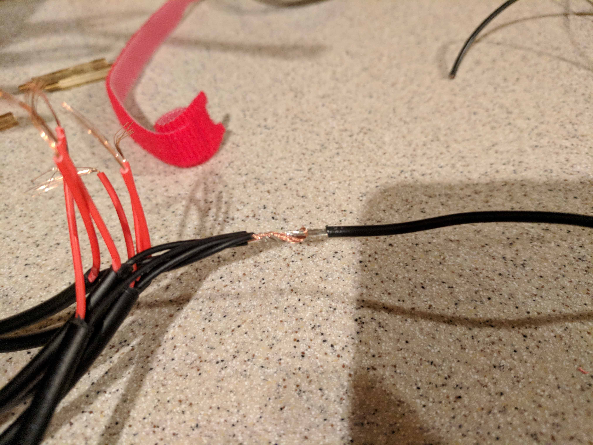
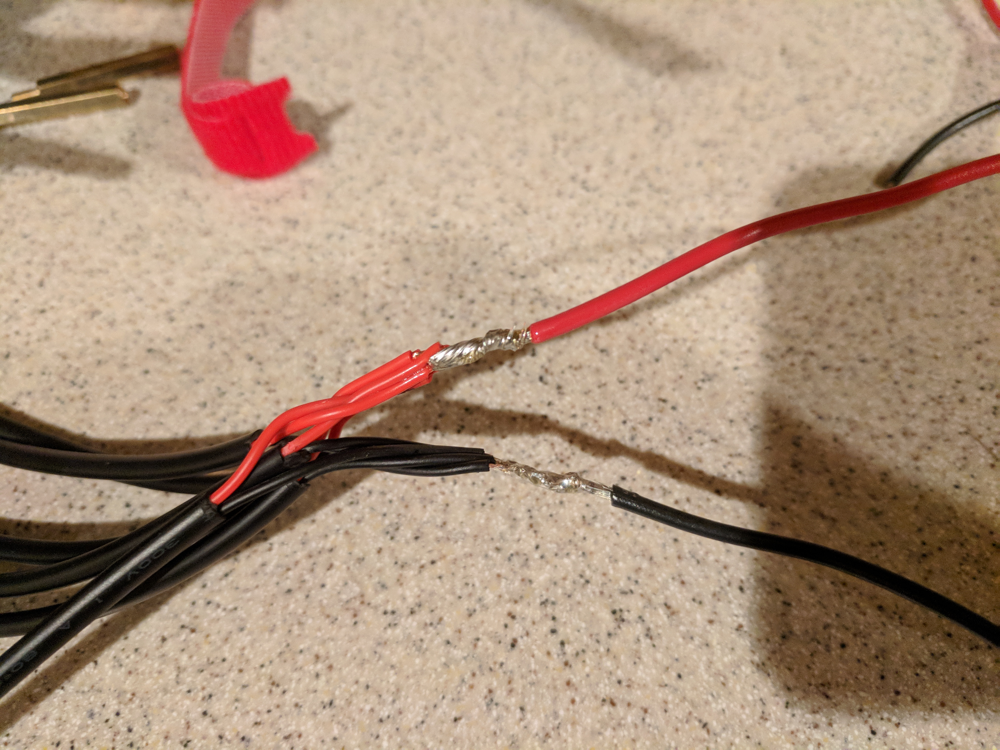
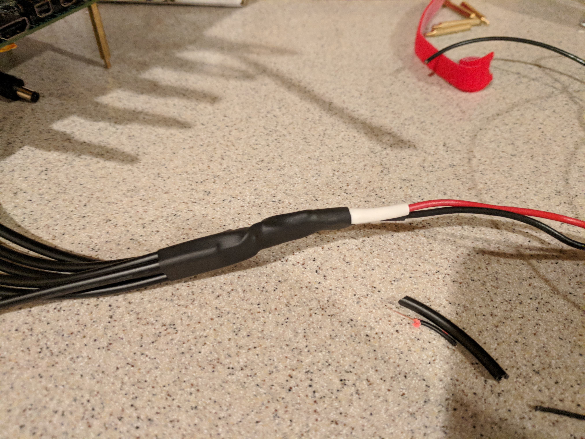

# Build

Now that you have all the parts, let's get building!

## Router Configuration

We need to do some pre-configuration of the hEX. This is so we can remotely connect to it after it is mounted in the case. It is difficult to get auxiliary network cables connected to it after it is in the case.

Note: Feel free to make changes to the `ros_kuberdoo.rsc` file before pasting the commands into the MikroTik CLI. But be sure to account for those changes later on if you change the network or passwords.

1. Connect up your computer to the second ethernet port and make sure it is configured for DHCP.
1. Power up the hEX with the included power adapter.
1. SSH or telnet to 192.168.88.1.
1. Accept the default configuration by hitting return or enter (you should then be at the prompt).
1. Copy and paste the configuration from https://github.com/andyshinn/kuberdoo/blob/master/config/ros_kuberdoo.rsc (this should get the NAT, firewall, VPN, and basics set up).

After loading the configuration, connect port 1 up to your home network, power cycle the hEX, and verify that you can connect to it (you will need to consult your home router to find out what address the MikroTik was given). For example, my home network is 10.0.1.0/24 and the MikroTik got an address of 10.0.1.58. I am able to connect to the device via SSH at 10.0.1.58 with user `admin` and password `kub3rd00`. There is also a web interface at http://10.0.1.58/ if you prefer to configure the device that way.

Now that we have verified the device can be remotely connected to, it is ready to be installed into the case. You can power off the hEX as it should be ready for mounting.

### UDOO Preparation

In addition to the router, we need to prep the UDOO boards so that they properly boot from PXE and failover to hard drive when no PXE server is available.

Install the M.2 SSDs onto all the boards. The UDOO X86 should have come with a small bag of M.2 mounting hardware.

This is optional, but I recommend using a small piece of double sided foam tape to hold down the CMOS battery.

The physical part of the boards should now be done.

We now need to prepare the BIOS.

1. Connect up a UDOO to monitor via HDMI or mini DisplayPort, keyboard, and a 12 volt DC power adapter. You can use the one that comes with the Netgear GS108 switch. But don't use the adapter that comes with the MikroTik hEX as it is 24 volts!
1. Start repeatedly pressing the <kbd>ESC</kbd> key on the keyboard while applying power to the UDOO board.
1. Enter the SCU once at the setup screen.
1. Navigate to _Power_ and set the _Power Fail Resume Type_ to _Always OFF_ (we don't want to boards automatically powering on).
1. Navigate to _Boot_ menu.
1. Set _Boot Type_ to _Legacy_ (UEFI doesn't failover to hard disk properly when PXE fails).
1. Enable _PXE boot to LAN_.
1. Navigate to _Exit_ and choose _Exit Saving Changes_.
1. Keep pressing the ESC key as the device reboots again.
1. Navigate to the _Boot_ menu again and there should be a new _Legacy_ menu.
1. Under _Legacy_ submenu navigate to _Boot Type Order_.
1. Highlight _Hard Disk Drive_ and use the <kbd>-</kbd> key to move it under _Other_ (so that PXE will boot before the SSD).
1. Navigate to _Exit_ and choose _Exit Saving Changes_.

Repeat these steps for all the boards. It is difficult to hook up HDMI and keyboard to the boards while they are in the case which  is why we do this now. We want the boards to boot and install headless.

### Wiring Harness

I started by mocking up the boards on the bottom panel and the PSU on the side panel. This helped give an idea of how long the DC plug pigtails needed to be for the wiring harness. I ended up making two, one harness for the 6 boards and one for the fan, switch, and router. The harnesses are the pigtails soldered to 18 AWG wire leads that plug into the positive and negative terminals on the PSU.

Measure a length of wire for both the positive and negative terminals. Strip off some insulation from the 6 pigtails and then from the wires of each pigtail. I first wrapped all the pigtail negative leads together and then wrapped them around the length of 18 AWG wire.

I takes a bit of solder to flow through all the strands. But you should end up with a solid connection. Give each of the pigtails a tug to make sure they are connected well.

I slipped a length of shrink tubing over each of the leads to insulate the solder joints from each other. Then, I added another larger piece of tubing over the entire thing to hold it together.

We will connect up the wires to the PSU terminals later so that we can better measure trim the wires to length.

### Mounting Switch

### Mounting Router
